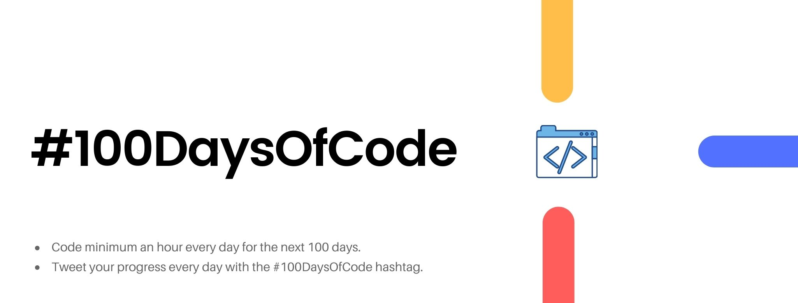

# I've joined the #100DaysOfCode Challenge

## Contents

* [Rules](rules.md)
* [Log - click here to see my progress](log.md)
* [FAQ](FAQ.md)
* [Resources](resources.md)

If you want to help by providing a translation of content/rules in the language you know, submit a pull request (or DM me on Twitter: [@AmitSwa44916029](https://twitter.com/AmitSwa44916029) Linkedin: [@amitswain](https://linkedin.com/in/amit-swain-32847b17a/) ).

## If you've decided to join:

0.  Check out [the Official Site](http://100daysofcode.com/) for the #100DaysOfCode movement. Connect with others on the platform of your choice from this list: www.100DaysOfCode.com/connect
    Also, [here](https://join.slack.com/t/100xcode/shared_invite/zt-gaxsv2fp-N8ORl8wxsOF3rHaXgavMLA) is a invite link to the 100DaysOfCode Slack channel
1.  Read [Join the #100DaysOfCode](https://medium.freecodecamp.com/join-the-100daysofcode-556ddb4579e4)
2.  Fork this repo and commit to the [Log](log.md) or to the Alternative, rapid [R5 Log](r1-log.md) (R5 stands for Round 5) daily. [Example](https://github.com/amitswain84/100-days-amitswain84-log).
3.  **Code minimum an hour every day for the next 100 days.**
4.  **Encourage at least two other people in the challenge on Twitter every day! Pay it forward!**
5.  Change the date in [Rules](rules.md) to the day you've started the challenge.
6.  Delete the examples in the log, or comment them out, and start filling it with your own content.
7.  **Tweet your progress every day using the #100DaysOfCode hashtag.**
8.  Follow [Alex, creator of #100DaysOfCode](https://twitter.com/ka11away) & [100DaysOfCode](https://twitter.com/_100DaysOfCode) Twitter Bot that retweets the tweets that contain the #100DaysOfCode hashtag. It's a great way to keep yourself motivated and to participate in the community. Thanks [@amanhimself](https://twitter.com/amanhimself) for creating it!
9.  Important: (see No.4 above for a specific rule on this) Encourage others who are doing the same challenge on Twitter or elsewhere - by giving them props when they are posting updates on their progress, supporting them when things get difficult. Thus we will grow a community that is helpful and effective, which will lead to a higher success rate for each person involved. It's also more likely that you will stick to your own commitment, given that you will get acquainted with a couple people (or more) right away.
10.  If you find a great, helpful resource that others would benefit from, either submit a Pull Request to add it to the repo, or just tweet at me (see info below)

## ⚡ Interested in meaningfully changing your life & getting the results you want?

I publish a newsletter called [Do the Opposite](https://dotheopposite.substack.com/) every other week. It's main focus is providing practical tips and techniques for improving the quality of your life - drawing from a wide variety of themes, listed below.

The themes covered are:
- **Habit Change**. Learn how to successfully acquire good habits and how to quit bad ones.
- **Book Recommendations & Takeaways**. Get awesome book recommendations and golden nuggets of wisdom extracted from these books so you can put them into action right away!
- **Personal Finance**. Even tiny change you make about how you manage your money will bring mind-boggling results over time. Find out what these changes are!
- **Starting a Business**. Whether you're a wanna-be indie maker or want to become the next Elon Musk, you will find some great resources here!
- **Overcoming Creative Blocks**. Together we explore how to beat the Resistance and finish that project you've been day-dreaming about.
- **Minimalism** Living with less has lots of benefits: reduced stress, less cleaning, better finances and a lot more!
- **Other topics**. Psychology, learning to code, alternative lifestyles and more.

## Want to change other habits?

Check out [the #100DaysOfX Challenges Project](http://100daysofx.com/). Changing your habits you are changing your life. Remember that the best time to start is always NOW.

I recommend that you commit to no more than 2-3 challenges at a time, ideally 2. If you are doing the #100DaysOfCode which involves a lot of mental activity, try the [#100DaysOfHealth](http://100daysofx.com/where-x-is/health/), or [#100DaysOfFitness](http://100daysofx.com/challenges/) challenges. There is so much more on the site, check all of them out and choose the ones you want to acquire! Languages, writing, meditation, journaling, cooking, and more!

## Note

* If you have any questions or ideas about 100DaysOfCode (or other ideas), feel free to reach out to me on Twitter: [@AmitSwa44916029](https://twitter.com/AmitSwa44916029)
Linkedin: [@amitswain32847b17a](https://linkedin.com/in/amit-swain-32847b17a/)
* If you like this repo and find it useful, please consider &#9733; starring it (on top right of the page) and forking it :)
